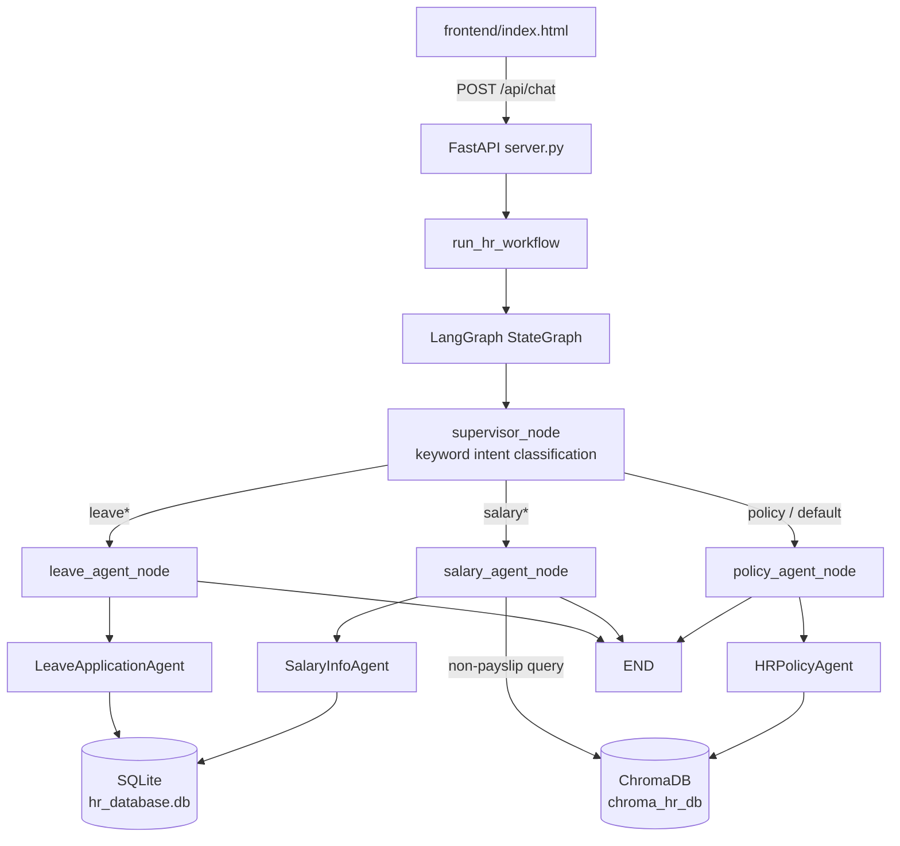

# LangGraph HR Multi-Agent Suite — Documentation

## 1. Overview

A multi-agent HR assistant built with **LangGraph** (`StateGraph`, supervisor pattern), backed by a **FastAPI** server and a static HTML/JS chat frontend. A supervisor node classifies each user query by keyword and routes it to one of three specialist agents, which read/write a local **SQLite** database and query a **ChromaDB** vector store (Ollama embeddings) for HR policy RAG.

There is no LLM call anywhere in the request path — "intent classification" and response formatting are done with plain Python (regex / substring matching and f-strings). The only place a model is actually invoked is the embedding model (`nomic-embed-text` via Ollama) used to build/query the vector store for policy RAG.

## 2. Component Map

| File | Responsibility |
|---|---|
| [server.py](server.py) | FastAPI app: HTTP routes, request validation, wires HTTP → orchestrator/DB |
| [orchestrator.py](orchestrator.py) | LangGraph `StateGraph` definition: supervisor + 3 agent nodes, routing logic |
| [agents.py](agents.py) | Three "specialist agent" classes — thin formatting wrappers around `database.py` / `vector_store.py` |
| [database.py](database.py) | SQLite schema, seed data, and all DB read/write helpers |
| [vector_store.py](vector_store.py) | ChromaDB collection setup, hard-coded HR policy documents, RAG search |
| [logger_config.py](logger_config.py) | Central logging config (rotating file handler + stdout), 7 named loggers |
| [frontend/index.html](frontend/index.html) | Single-file dark-themed chat UI (no framework), talks to `POST /api/chat` |
| `hr_database.db` | SQLite data file (created on first run) |
| `chroma_hr_db/` | Persisted ChromaDB vector index (created on first run) |
| `logs/` | Rotating daily log files (created on first run) |

## 3. Architecture / Request Flow



### 3.1 Supervisor routing (`orchestrator.py::supervisor_node`)

Routing is pure keyword matching over `state["user_query"].lower()`, evaluated in this priority order:

1. **leave_agent** — `leave`, `vacation`, `pto`, `off`, `sick leave`, `casual leave`, `apply leave`, `balance`
2. **salary_agent** — `salary`, `pay`, `payslip`, `allowance`, `ctc`, `tax`, `deduction`, `income`, `compensation`
3. **policy_agent** — `policy`, `rule`, `working hours`, `remote work`, `probation`, `notice`, `insurance`, `reimbursement`, `wfh`
4. Anything else falls through to **policy_agent** (default/fallback).

The employee ID is extracted from the raw query text via regex `\bEMP\d{3,4}\b` (case-insensitive); if absent, it falls back to the `employee_id` passed in from the API request (default `EMP001`).

### 3.2 Specialist nodes

- **`leave_agent_node`**: further branches on the query text —
  - contains `apply`/`request`/`take leave` → `LeaveApplicationAgent.apply_for_leave(...)`. **Note:** the leave type is inferred from keywords, but dates/duration are hard-coded (`2026-08-01` → `2026-08-02`, 2 days, reason `"Personal work"`) — there is no real date/duration parsing from natural language.
  - contains `history`/`past`/`applied` → `get_leave_history`
  - otherwise → `check_leave_balance`
- **`salary_agent_node`**: contains `slip`/`pay`/`take home`/`net`/`salary` → `get_salary_details` (SQLite); otherwise → `get_salary_policy_info` (RAG search against the same ChromaDB store used by the policy agent).
- **`policy_agent_node`**: always does a ChromaDB similarity search (`k=3`) over the raw query.

All three specialist nodes are terminal — each has a direct edge to `END` (no loops, no re-routing, no multi-agent collaboration within a single query).

## 4. Data Model (SQLite — `hr_database.db`)

Created and seeded automatically by `database.py::init_db()` on import (called at module load time, so importing `database.py` anywhere has a side effect of creating/seeding the DB).

**`employees`**
| column | type | notes |
|---|---|---|
| employee_id | TEXT PK | e.g. `EMP001` |
| name, email, department, designation | TEXT | |
| base_salary, tax_deductions, allowances, net_salary | REAL | **annual** figures; monthly values are computed on read (`/12`) in `get_salary_info` |
| joined_date | TEXT | |

**`leave_balances`** — `employee_id` PK/FK, `casual_leave`, `sick_leave`, `earned_leave` (INTEGER, days remaining).

**`leave_applications`** — autoincrement `id`, `employee_id` FK, `leave_type`, `start_date`, `end_date`, `days`, `reason`, `status` (always `APPROVED` — there is no pending/rejected state or approval workflow), `applied_at`.

Seed data: 3 demo employees (`EMP001` John Doe/Engineering, `EMP002` Sarah Smith/HR, `EMP003` Alex Johnson/Product) plus one historical leave application for `EMP001`.

Leave submission (`submit_leave_application`) validates the employee exists and that the relevant balance column has enough days, deducts the balance, and inserts an `APPROVED` row — all in one un-transacted sequence of `cursor.execute` calls (see §6 Observations).

## 5. Vector Store / RAG (`vector_store.py`)

- Backing store: **ChromaDB**, persisted to `chroma_hr_db/`, collection name `hr_policies_and_salary`.
- Embeddings: **Ollama** `nomic-embed-text` model, expected at `http://localhost:11434`. If Ollama is unreachable, the module logs a warning and `search_policy` degrades to returning `"HR Policy vector database is currently offline."` rather than raising.
- Knowledge base is **4 hard-coded `Document` objects** in-source (not loaded from external files): Leave & Attendance, Working Hours/Remote/Overtime, Salary Structure/Taxation, Probation/Performance/Reimbursement. Split with `RecursiveCharacterTextSplitter(chunk_size=500, chunk_overlap=80)` into 8 chunks, indexed once (skipped if the collection already has documents).
- `search_policy(query)` retrieves top-`k=3` chunks via similarity search and formats them into a readable string with the section title.

## 6. API Reference (`server.py`, port 8001)

| Method & Path | Purpose | Notes |
|---|---|---|
| `GET /api/health` | Liveness/info | Static payload, no actual health checks on DB/vector store |
| `POST /api/chat` | Main entry point — natural language query + `employee_id` | Runs full LangGraph workflow; 400 if `message` empty |
| `GET /api/employees/{emp_id}/leave` | Direct leave balance + history | Bypasses LangGraph entirely, calls `database.py` directly |
| `GET /api/employees/{emp_id}/salary` | Direct salary breakdown | Bypasses LangGraph |
| `POST /api/leave/apply` | Direct leave submission with explicit dates/reason/days | Bypasses LangGraph; the only way to submit a leave request with real (non-hard-coded) dates |

CORS is fully open (`allow_origins=["*"]`). No authentication/authorization on any route — any caller can query or submit leave for any `employee_id`.

## 7. Logging System

Configured centrally in [logger_config.py](logger_config.py), imported (and thus initialized) as a side effect of importing `database.py` or `vector_store.py`.

- **Handlers**: `RotatingFileHandler` (5 MB/file, 5 backups) writing to `logs/hr_agent_<YYYY-MM-DD>.log`, plus a `StreamHandler` to stdout. Both share one format:
  `%(asctime)s  [%(levelname)-8s]  %(name)-28s │ %(message)s`
- **Named loggers**:

| Logger | Used in | Covers |
|---|---|---|
| `hr_agent` | logger_config.py | Startup banner |
| `hr_agent.api` | server.py | HTTP request/response for every route |
| `hr_agent.orchestrator` | orchestrator.py | Supervisor routing decisions, workflow start/end |
| `hr_agent.leave` | database.py | Leave balance/history/apply queries |
| `hr_agent.salary` | database.py | Salary lookups |
| `hr_agent.policy` | vector_store.py | ChromaDB init + RAG search results/timings |
| `hr_agent.db` | database.py | DB init/seeding |

- Third-party loggers (`httpx`, `httpcore`, `chromadb`, `urllib3`, `langchain`) are silenced to `WARNING` to keep the file readable.

### 7.1 Fix applied during this analysis

`api_logger` and `graph_logger` were **defined in `logger_config.py` but never imported or called anywhere** — `server.py` and `orchestrator.py` had zero logging despite every other layer being instrumented. This meant the log file only ever showed DB/vector-store initialization, never actual API traffic or routing decisions. Added:

- `orchestrator.py`: logs the supervisor's routing decision (query → chosen agent) and workflow start/end (with output size) via `graph_logger`.
- `server.py`: logs every request/response and failure (400/404) on all 5 routes via `api_logger`.

### 7.2 Sample log file

A fresh, fully-populated log was generated by starting the server and exercising all three agents plus error paths (unknown employee, insufficient leave balance, missing salary record): [logs/hr_agent_2026-07-30.log](logs/hr_agent_2026-07-30.log). It now shows, end-to-end, for a single request:

```
📨 POST /api/chat | employee_id=EMP001 | message='What is my leave balance?'
▶️ [Workflow Start] Invoking LangGraph StateGraph for query: 'What is my leave balance?'
🧭 [Supervisor] Query: '...' | Employee: EMP001 | Routed → leave_agent
🗓️ [SQLite] Querying leave balance for 'EMP001'
   Result: CL=10, SL=8, EL=14
⏹️ [Workflow End] Agent: leave_agent | Output length: 206 chars
📤 POST /api/chat response | agent=leave_agent
```

and equivalent traces for the salary agent, the policy agent (including ChromaDB retrieval timing, e.g. `4478.6 ms` on a cold embedding call vs. `~75 ms` once warmed up), and warning-level entries for an unknown employee ID, a missing salary record (404), and an insufficient-leave-balance rejection (400).

## 8. Running the Project

```powershell
# from LangGraph_HR_Agent/
pip install fastapi uvicorn langgraph langchain-community langchain-text-splitters langchain-ollama
# Ollama must be running locally with the embedding model pulled:
ollama pull nomic-embed-text

python -m uvicorn server:app --reload --port 8001
# then open frontend/index.html in a browser (it calls http://localhost:8001)
```

SQLite DB, ChromaDB index, and `logs/` are all created automatically on first import — no manual setup step needed.

## 9. Known Limitations (observed during analysis)

- **No LLM reasoning**: despite the "agent" naming, routing and leave-type detection are keyword/regex matching, not model-driven. Only the embedding model is a real ML component.
- **Hard-coded leave dates** when applying via the chat path (`orchestrator.py::leave_agent_node`) — natural-language dates/duration are not parsed; only the direct `POST /api/leave/apply` endpoint accepts real dates.
- **No auth**: any `employee_id` can be queried or used to submit leave from any client; CORS is wide open.
- **No transactions**: `submit_leave_application` performs a balance-check, an `UPDATE`, and an `INSERT` as separate un-transacted statements — a crash between them could deduct balance without recording the application (or vice versa).
- **All leave applications auto-approve**: there's no pending/manager-approval state.
- **Vector store degrades silently**: if Ollama isn't running, policy/salary-RAG queries return an "offline" string rather than an error, which could mask an outage in production.
- **Health endpoint is static**: `/api/health` doesn't actually probe the DB file or the ChromaDB/Ollama connection.
