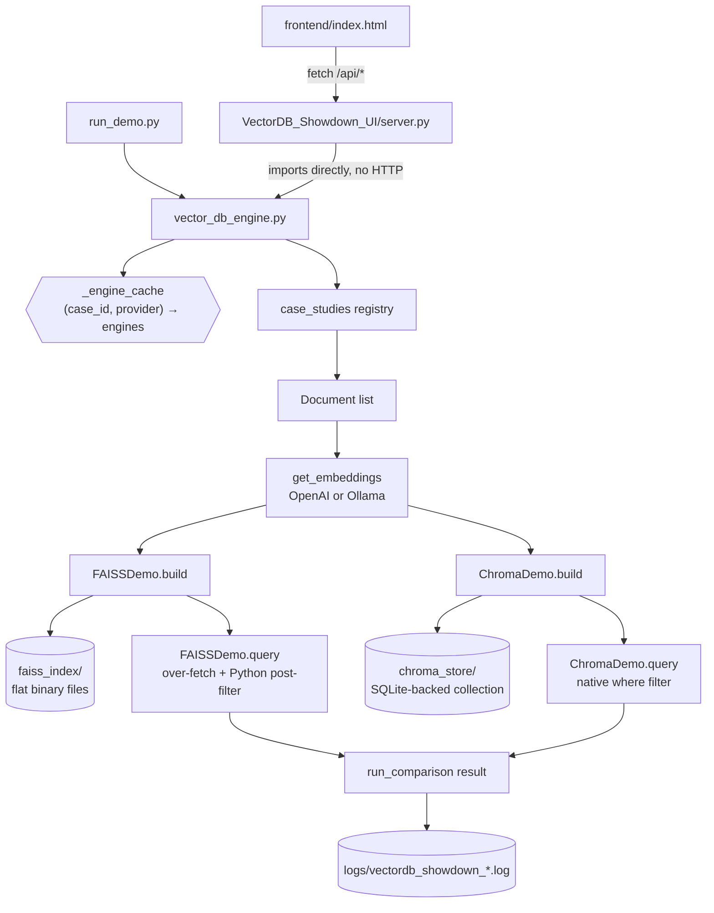

# Vector DB Showdown — FAISS vs Chroma — Documentation

## 1. Overview

A lecture demo that builds **the same documents through the same embeddings** into two different vector backends — **FAISS** (a pure ANN index library) and **Chroma** (an embedded vector database) — and compares them side by side on build time, disk footprint, query latency, persistence model, and metadata filtering.

There are two companion program folders:

- **`VectorDB_Showdown/`** (this folder) — the core engine and a Rich-powered terminal walkthrough (`run_demo.py`).
- **`VectorDB_Showdown_UI/`** (sibling folder) — a FastAPI backend that imports this engine directly (no duplicated logic) plus a single-file HTML/JS dashboard, for driving the same comparisons from a browser during a live talk.

No LLM is called anywhere in this demo — the only model in the request path is the **embedding model** (OpenAI `text-embedding-3-small` or Ollama `nomic-embed-text`, selectable per run).

## 2. Component Map

| File | Responsibility |
|---|---|
| [vector_db_engine.py](vector_db_engine.py) | Core engine: `FAISSDemo`/`ChromaDemo` wrapper classes, embedding provider selection, build/query/clear orchestration, in-memory build cache |
| [case_studies/\_\_init\_\_.py](case_studies/__init__.py) | Registry mapping each case study id to its loader, sample queries, and optional metadata `filter_demo` |
| [case_studies/customer_support.py](case_studies/customer_support.py) | Case Study 1 — 16 tagged support tickets (metadata filtering demo) |
| [case_studies/campus_policy.py](case_studies/campus_policy.py) | Case Study 2 — one long unstructured document, chunked (scale/speed demo) |
| [run_demo.py](run_demo.py) | CLI entry point — Rich tables in the terminal, walks all case studies end to end |
| [logger_config.py](logger_config.py) | Engine-side logging: rotating file handler + stdout, 5 named loggers under the `vdb` namespace |
| [../VectorDB_Showdown_UI/server.py](../VectorDB_Showdown_UI/server.py) | FastAPI wrapper exposing the engine over HTTP (`/api/build`, `/api/query`, `/api/clear`, `/api/logs/latest`) |
| [../VectorDB_Showdown_UI/ui_logger_config.py](../VectorDB_Showdown_UI/ui_logger_config.py) | UI-side logging: separate `vdb_ui` namespace so it doesn't collide with the engine's `vdb` logger |
| [../VectorDB_Showdown_UI/frontend/index.html](../VectorDB_Showdown_UI/frontend/index.html) | Single-file dashboard (no build step) — case-study picker, provider toggle, results panel, live log tail |
| `faiss_index/` | Persisted FAISS indexes, one subfolder per `<case_id>_<provider>` (created on first build) |
| `chroma_store/` | Persisted Chroma collections (SQLite-backed), one subfolder per `<case_id>_<provider>` (created on first build) |
| `logs/` | Rotating daily engine log files (created on first run) |

## 3. Architecture / Request Flow



### 3.1 Build phase (`build_both`)

1. Resolve the embedding provider (`get_embeddings`) — explicit `provider=` argument, else the shared `.env`'s `MODEL_PROVIDER` (`ollama` by default).
2. Cache check: `(case_id, provider)` already built this process and `force_rebuild=False` → return the cached `(FAISSDemo, ChromaDemo)` pair immediately.
3. Otherwise, load the case study's documents once (`case_studies.load_case_study`) and build **both** engines from that identical list + identical embeddings instance, so any measured difference is attributable to the vector database, not the input.
4. Cache the pair under `(case_id, provider)`.

### 3.2 Query phase (`run_comparison`)

Runs the same query, `k`, and (optionally) metadata filter through both engines back to back and returns one merged dict per engine (build stats + query results), plus a `faiss_vs_chroma_latency_ratio`.

### 3.3 The FAISS vs Chroma difference, concretely

| | FAISS | Chroma |
|---|---|---|
| What it is | ANN index library (in-memory) | Embedded vector database |
| Persistence | Manual — `save_local()` dumps `index.faiss` + `index.pkl` to a folder; no query engine, just files | Automatic — SQLite-backed `persist_directory`, queryable as a live collection |
| Metadata filtering | **None natively.** `FAISSDemo.query()` over-fetches `k*5` results, then filters in Python (`vector_db_engine.py:127-138`) | **Native.** Filter dict passed straight into `similarity_search_with_score(..., filter=where)` — narrows the search itself |
| Typical build/query speed | Faster at these small scales (pure C++ ANN, no metadata/SQL overhead) | Slightly slower (extra client + SQLite layer), but gains a real queryable store |

### 3.4 Clear / reset (`clear_indexes`)

Deletes matching entries from `_engine_cache` and `shutil.rmtree`s the matching `faiss_index/<case>_<provider>` and `chroma_store/<case>_<provider>` folders. Called with no arguments, it wipes everything — used by the UI's **"Clear all indexes"** button so the next build/query starts completely fresh for any case study/provider combination.

## 4. Case Studies

| id | Documents | Metadata | Demonstrates |
|---|---|---|---|
| `customer_support` | 16 short support tickets (hard-coded list) | `category`, `priority` | Native (Chroma) vs. post-hoc (FAISS) metadata filtering |
| `campus_policy` | One long handbook, chunked via `RecursiveCharacterTextSplitter(chunk_size=300, chunk_overlap=50)` | none | Build/query speed at moderate scale with no metadata |

Both are registered in `case_studies.CASE_STUDIES` with a `name`, `description`, `sample_queries`, and optional `filter_demo` (`{"field": ..., "value": ...}` or `None`) — this dict is the single source of truth both `run_demo.py` and the UI's `/api/case-studies` endpoint read from.

## 5. API Reference (`VectorDB_Showdown_UI/server.py`, port 8010)

| Method & Path | Purpose | Notes |
|---|---|---|
| `GET /api/health` | Liveness + default provider | Polled every 10s by the UI to drive the status dot |
| `GET /api/case-studies` | Case study metadata for the picker/chips/filter toggle | Never exposes the raw loader functions |
| `POST /api/build` | Build (or reuse cached) engines without querying | `{case_study, provider?, force_rebuild?}` |
| `POST /api/query` | Build-if-needed + run one query through both engines | `{case_study, query, provider?, k?, use_filter?}` |
| `POST /api/clear` | Wipe persisted stores + build cache, scoped or all | `{case_study?, provider?}` — both omitted = wipe everything |
| `GET /api/logs/latest` | Tail the engine or UI log file | `?lines=60&source=engine\|ui` |

CORS is fully open (`allow_origins=["*"]`) — this is a local lecture demo served to a static HTML file opened from disk, not a deployed multi-tenant service.

## 6. Logging System

Two independent namespaces so engine and UI logs never collide even though the UI imports the engine directly into the same process:

- **Engine** (`vdb.*`, [logger_config.py](logger_config.py)) → `logs/vectordb_showdown_<date>.log`
  - `vdb.embedding`, `vdb.faiss`, `vdb.chroma`, `vdb.compare`, `vdb.case_study`
- **UI** (`vdb_ui.*`, [../VectorDB_Showdown_UI/ui_logger_config.py](../VectorDB_Showdown_UI/ui_logger_config.py)) → `../VectorDB_Showdown_UI/logs/vectordb_ui_<date>.log`
  - `vdb_ui.api` — every HTTP request/response with timing, via `server.py`'s `log_requests` middleware

Both attach handlers directly to their namespace logger (`propagate=False`) rather than calling `logging.basicConfig()`, because `basicConfig()` only configures the root logger once per process — since the UI imports the engine into the *same* process, whichever module's `basicConfig()` ran first would silently win and the other's log file would stop receiving lines.

`log_banner(logger, title)` prints a `====` bordered section header — used to make build/query/clear phase boundaries easy to point at on-screen while narrating the log file live.

Third-party loggers (`httpx`, `httpcore`, `chromadb`, `urllib3`, `openai`) are capped at `WARNING` in both namespaces to keep the trace readable.

## 7. Running the Project

**CLI demo:**
```powershell
cd "c:\AI Agent study\VectorDB_Showdown"
..\venv\Scripts\python.exe run_demo.py [--provider openai|ollama] [--case all|customer_support|campus_policy]
```

**Web UI:**
```powershell
cd "c:\AI Agent study\VectorDB_Showdown_UI"
..\venv\Scripts\python.exe -m uvicorn server:app --port 8010 --reload
```
Then open `frontend/index.html` directly in a browser (it calls `http://localhost:8010`).

**Provider setup** — selected via the shared root `.env`'s `MODEL_PROVIDER` (`openai` or `ollama`), overridable per-call:
- `openai` needs `OPENAI_API_KEY` set in the shared `.env`.
- `ollama` needs a local Ollama server reachable at `OLLAMA_BASE_URL` (default `http://localhost:11434`) with `nomic-embed-text` pulled (`ollama pull nomic-embed-text`).

`faiss_index/`, `chroma_store/`, and `logs/` are all created automatically on first build — no manual setup step.

## 8. Known Limitations

- **Small-scale demo data only** — 16 tickets / one handbook. Timing differences at this scale (millisecond range) are illustrative, not representative of behavior at production scale (10k–1M+ vectors), where the tradeoffs shift.
- **No incremental updates** — every build is a full rebuild from the case study's document list; neither engine wrapper supports upsert/delete-by-id.
- **In-memory cache has no eviction beyond `clear_indexes()`** — `_engine_cache` grows for as long as the process runs; not an issue at 2 case studies × 2 providers, but not designed for many more.
- **`similarity_search_with_score`'s score isn't normalized identically** across FAISS (raw L2 distance) and Chroma (backend-dependent) — the demo shows both scores side by side but does not claim they're on the same scale; only latency and result relevance are meant to be compared directly.
- **CORS wide open, no auth** — acceptable for a local lecture demo, not for any deployed use.
